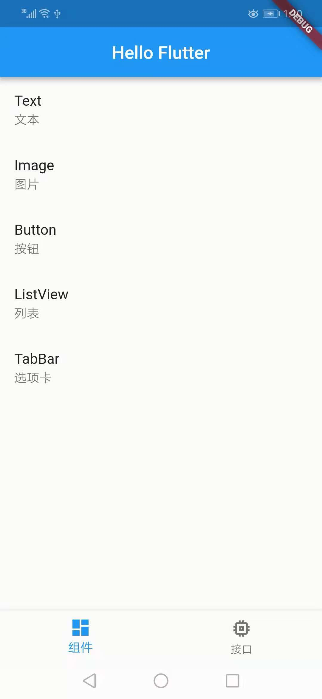

# Hello Flutter

An example App for Flutter  Framework.

## Contents

### Feature

- slide_transition_page_route(页面转场动画)

### UI

- Text(文本)
- Button(按钮)
- Image(图片)
- ListView(列表)
- TabBar(选项卡)
- Charts(图表)

### API

- Clipboard(剪贴板)
- DeviceInfo(设备信息)
- DeviceApps(设备应用)
- WebView(设备应用)

### Example

- ListToDetail(列表到详情)

## Document

官网：https://flutter.io/

## Tool

Flutter WebIDE: https://flutterstudio.app/

## Reference

- https://github.com/Solido/awesome-flutter
- https://flutterawesome.com/
- https://github.com/OpenFlutter
- https://github.com/chinabrant/flutter_study

## 文章

- Flutter底部导航栏NavigationBar的几种实践：https://www.jianshu.com/p/3bf61b805d11